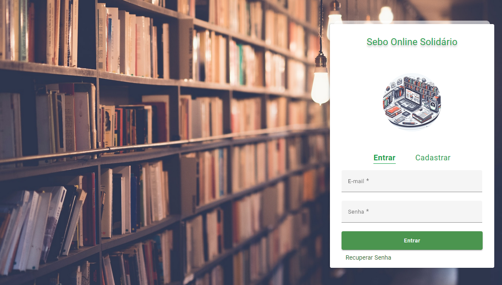

<h1 align="center">
  Projeto TCC / SeboOnline Solidário
</h1>

 
 

## Tecnologias

- [NPM](https://www.npmjs.com/)
- [Angular 16](https://angular.io/guide/update-to-version-16)
- [Node 18.16.0](https://nodejs.org/en)
- [Material](https://material.angular.io/)

### APP SeboOnline : 

 

# Instruções : 

## Fazer o Clone do projeto na sua Máquina
git clone url

## Rodar o comando para o Angular carregar os pacotes :

npm install

## Rodar o comando para executar :

ng serve

### Acessar a url : 

Acessar a `http://localhost:4200/`

